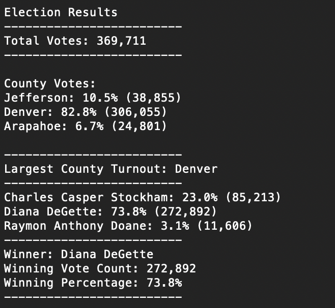

# election_analysis

## Overview of Election Audit

There recently was an election for the US Congressional Precinct in Colorado. An employee from the Colorado Board of Election Committee is requesting support to summarize the results using python. These results will aid in automating the process of auditing and certifying this election, other congressional disticts, and local elections. 

## Election-Audit Results

- The total number of votes cast in the election was 369,711.

- The counties included in the race were Jefferson, Denver & Arapahoe
  - Jefferson received 10.5% of the votes, which was 38,885 of the total votes
  - Denver received 82.8% of the votes, which was 306,055 of the total votes
  - Arapahoe received 6.7% of the votes, which was 24,801 of the total votes
  
- Denver had the largets number of votes by county 

- The candidates in the race were Charles Casper Stockham, Diana DeGette, and Raymon Anthony Doane
  - Charles Casper Stockham received 23.0% of the votes, which was 85,213 of the total votes
  - Diana DeGette received 73.8% of the votes, which was 272,892 of the total votes
  - Raymon Anthony Doane received 3.1% of the votes, which was 11,606 of the total votes
 
- Diana DeGette won the election with 73.8% of the votes, by receiving 272,892 votes of the total 369,711 votes. 

## Election-Audit Summary 
