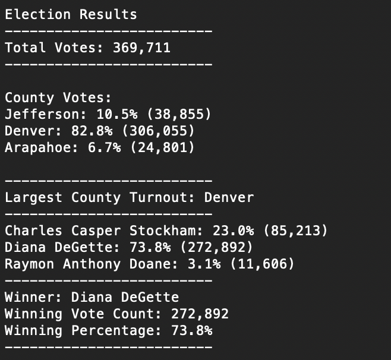

# Colorado Election Analysis 

## Overview of Election Audit

There recently was an election for the US Congressional Precinct in Colorado. An employee from the Colorado Board of Election Committee is requesting support to summarize the results using python. These results will aid in automating the process of auditing and certifying this election, other congressional disticts, and local elections. This analysis also includes more granular statistics like percentage of votes for each county, voter turnout for each county and which had the highest turnout also. 

## Election-Audit Results

- The total number of votes cast in the election was 369,711.

- The counties included in the race were Jefferson, Denver & Arapahoe.
  - Jefferson received 10.5% of the votes, which was 38,885 of the total votes.
  - Denver received 82.8% of the votes, which was 306,055 of the total votes.
  - Arapahoe received 6.7% of the votes, which was 24,801 of the total votes.
  
- Denver had the largets number of votes by county.

- The candidates in the race were Charles Casper Stockham, Diana DeGette, and Raymon Anthony Doane.
  - Charles Casper Stockham received 23.0% of the votes, which was 85,213 of the total votes.
  - Diana DeGette received 73.8% of the votes, which was 272,892 of the total votes.
  - Raymon Anthony Doane received 3.1% of the votes, which was 11,606 of the total votes.
 
- Diana DeGette won the election with 73.8% of the votes, by receiving 272,892 votes of the total 369,711 votes. 



## Election-Audit Summary

The script provided for this election audit can be altered to fit any other type of election desired. For example, in this election we were looking at the results by county, however we could look at it by state or also by city. The setup for this would be very similar to the setup now, we would just have to ensure that the city or state data is also in the election_results.csv, and then summarize by city or state instead of by county. Another example of a change we can make to the election script is to change what fields we summarize on depending on what type of election. Or add more information depending on the type of election. For example, if we were looking at summarizing results for a federal election, we could summarize who won from each county, then aggregate that into who won from each state (Democrat or Republican could be added) and then based on those results we could then see who won the overall election. We could also add in data to learn more about demographics if thats wanted. For example, we could add their ages in to find out which generations are voting more than others to know where to target potential areas needing support. 

### Examples:
  ```
    county_name = row[1]
```
Can be changed to:
   ```
    state_name = row[1]
```
  
